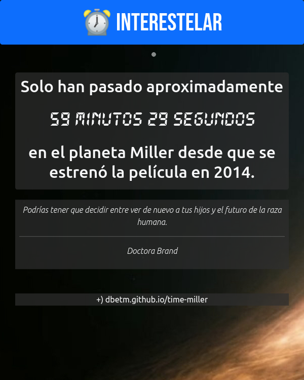

# Time Miller
Una app web para saber cúanto tiempo ha pasado en el planeta Miller (o Planeta de Miller) desde el estreno de la película Interstellar.

El tiempo transcurre más lento (respecto a la Tierra) en aquel planeta ficticio debido a los efectos de la gravedad por un agujero negro supermasivo llamado Gargantúa.

[Read in English / Leer en inglés](README.md)

**Funcionalidades**
- Calcular y mostrar el tiempo que ha pasado en Miller desde el estreno de la película (en la Tierra) en días, horas, minutos y segundos.
- Descargar imagen como captura con frase random de la película.
- Tocar reloj para escuchar el tema música principal de la película.

### ¿Cómo funciona?

Se toma el hecho de que cada tic-tac que ocurre cada 1.25 segundos en la música de fondo en las escenas del planeta Océano "Miller" equivalen a 1 un día completo (24 horas) en el Planeta Tierra 🌎.

Se toma el hecho de que la película se estrenó el 26 de octubre del 2014 a las 00:00, tiempo relativo a cualquier zona horaria.

**Ejemplo**

Si hoy es _sábado 20 de agosto del 2022_ en la Tierra, entonces aquí han pasado 2,855 días, o sea, 2855 tic-tacs en el Planeta Miller que son 2855*1.25 segundos => 3568.75 segundos => 59 minutos y 29 segundos.

