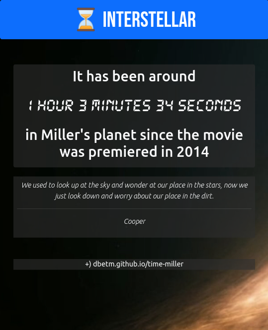

# Miller's time
A web app to know how much time has happened in the Miller's planet since the Interstellar movie was premiered.

The time happens more slowly (compared to the Earth) in the fictional planet because the gravity effects by a supermassive black hole called Gargantua.

[Leer en español / Read in Spanish](README.es.md)

**Features**
- Compute and display the time that has happened in Miller's planet since the premiered of the movie (in Earth) in days, minutes and seconds.
- Compute the earth-days left for Miller to have had watch the movie.
- Generate screenshot with a random quote from the movie.
- Play the main soundtrack of the movie.
- Content displayed in English (default) and Spanish.

### How does it work?

The fact is taken that each tic-tac that occurs every 1.25 seconds in the background music in the scenes of the planet Ocean "Miller" is equivalent to one full day (24 hours) on Planet Earth 🌎.

It is taken as a fact that the movie was released on October 26th, 2014 at 00:00, relative to any time zone.

**Example**

If today is _Saturday, March 4th, 2023_ on Earth, then 3,051 days have passed here, which means 3,051 tick-tocks on Planet Miller, which are 3,051*1.25 seconds => 3,813.75 seconds => **1 hour, 3 minutes and 34 seconds**.

---------

### Contribute

Feel free to open a Pull Request with enhancements.

